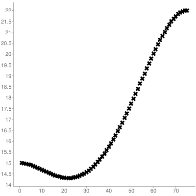
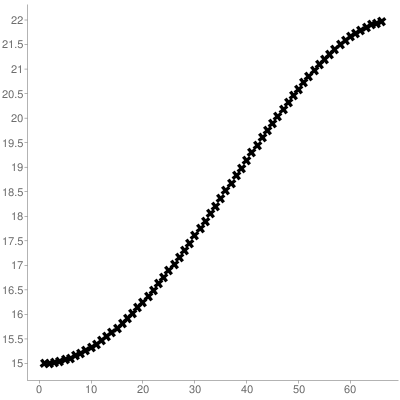
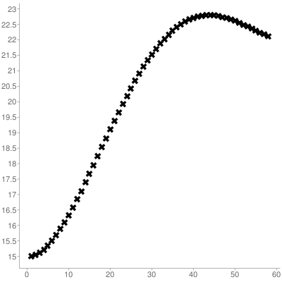

# CarND-Path-Planning-Project
Self-Driving Car Engineer Nanodegree Program
   
## High Level Code Description

The code is broken up into a class called FSM and a function called CreatePath. CreatePath is called by the main loop and all of its code is located in main.cpp. CreatePath uses the class FSM (located in behavoir\_fsm.cpp).

FSM deals solely in frenet coordinates and is responsible for the high level planning. It processes the sensor fusion data to determine which state should be selected and based on its state it determines a frenet coordinate waypoint for the car to travel too. CreatePath takes in the frenet coordinate waypoint, translates it to cartesian coordinates, and generates a jerk minimizing trajectory to reach the waypoint destination.

## Rubric
### The car drives according to the speed limit.
The car stays below the speed limit through two main methods. First final speed the car is trying to obtain when generating a jerk minimizing tracjory is 98% of the max speed limit. Second, all of the end times for the jerk minimizing trajectories (JMT) are set using the equation and logic seen below.

Setting the time correctly when generating a JMT is one of the most important and difficult aspects. If you set the time too short, the trajectory will have the car exceed the final speed you set as the car needs to make up ground in order to get to its final destination on time and going the correct speed. Conversely, If you set too large of a time, the trajectory will initially undershoot its current speed otherwise it would get to the destination too fast. Below are 3 graphs of JMT generated using the same code used in this project. The middle is a correct trajectory, the other two contain either overshooting or undershooting the current speed.

Overshooting is an issue because it will eventually cause the car to exceed the speed limit. Undershooting however, is also a major issue. If a new trajectory is generated often, then the next starting point could be at a speed lower than the cars original speed (because of the undershoot). This will cause the next trajectory generated to also undershoot, reducing the speed further. Eventually the car would reach some steady state where it's speed won't increase or decrease, despite not being anywhere close to the final speed desired by the generated JMT.

Using experimenting with different JMT time values I came up with the following empircal equation. Using the cars current speed and final speed, this equation will always generate a JMT that contains no overshoot or undershoot of speed. There seems to be some sort of exponentially decaying relationship going on (0.81 = 0.9<sup>2</sup>, 0.65 = 0.9<sup>4</sup>) but I didn't find it.

```
double Fsm::TimeToPath(double dist)
{
  if (car_speed*mph_to_ms < 13.5 && car_speed*mph_to_ms >= 10) {
    coeff_emp = 0.9;
  } else if (car_speed*mph_to_ms < 10 && car_speed*mph_to_ms >= 7.5) {
    coeff_emp = 0.8;
  } else if (car_speed*mph_to_ms < 7.5){
    coeff_emp = 0.65;
  }
  if (car_speed*mph_to_ms > 5) {
    time_to_s_path = ((dist / final_speed) + coeff_emp*(dist / (car_speed*mph_to_ms)))/2;
  } else {
    time_to_s_path = 2.25*dist/25.0;
  }
  return time_to_s_path;
}
```






### Max Acceleration and Jerk are not Exceeded.
Max acceleration and max jerk and avoided by using jerk minimizing tractory generation with proper boundary conditions. Also previously generated tracjectory's are used for generating new tracjory's (see below code) to ensure smooth transitions between newly generated paths.

```
vector<double> y;
 if (prev_y.size() < 10) {
   start = {car_y, car_speed*mph_to_ms*sin(car_yaw * 3.14159 / 180), 0};
 } else {
   double v1 = (prev_y[9] - prev_y[8])*50;
   double v0 = (prev_y[8] - prev_y[7])*50;
   start = {prev_y[9], v1, v1 - v0};
   for (int i = 1; i <= 9; i++) {
     y.push_back(prev_y[i]);
   }
 }
 ```
 
 ### Car does not have collisions and the car is able to change lanes.
 The FSM class switches between finite states to ensure that the car won't collide with other cars on the road. Once a car is spotted within range by looking at the sensor fusion data, the FSM will switch to follow car mode, which first maintains a safe distance behind the car infront of it and then matches it speed. If there is an opening in an adjacent lane the car will then move to this lane and pass the car if it is free to do so.
 
All of this happens with in the function Fsm::FollowCar(), Fsm::PrepareLaneSwitch(), and Fsm::SwitchLanes().


### The car stays in its lane, except for the time between changing lanes.
The function Fsm::StayInLane() is the default state when there are no other cars around. This keeps the car in the lane it is currently in. When changing lanes a single JMT is produced which executes the lane change in about 2 seconds.
